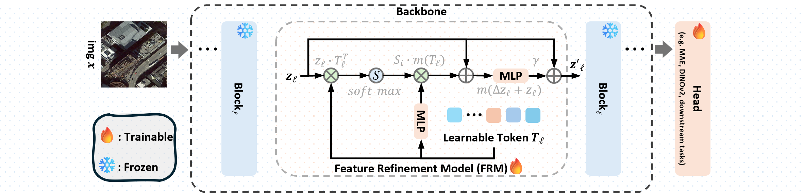

<div align="center">

<h2 style="border-bottom: 1px solid lightgray;">
Geoad: Towards Geospatial Foundation Models via Efficient Continual Pre-Training
</h2>

<div style="display: flex; align-items: center; justify-content: center;">
<p align="center">
  <br align="center">
    <a href='#'></a>
    
    
    
    
    </br>
    
    
    
    
</p>
</div>
<br/>

<div style="display: flex; align-items: center; justify-content: center;"> Network Overview </div>

</div>


### 🔍️🔍️ NEWS

- [2025/11/17] ✨✨ The [arxiv] paper will coming soon.


### 📄📄 TODO

- ❎ submit to arxiv
- ❎ upload training code
- ❎ upload model weights

## Clone Repo

---
We add [mmpretrain](https://github.com/open-mmlab/mmpretrain),
[mmsegmentation](https://github.com/open-mmlab/mmsegmentation), and
[open-cd](https://github.com/likyoo/open-cd)
as our repository 
[submodule](https://git-scm.com/book/en/v2/Git-Tools-Submodules) .

So, one should clone this repository use the script as follows:

<details>
<summary>clone repository</summary>

```shell
git clone --recurse-submodules https://github.com/woldier/Geoad
```
> ### Tips
> If one already cloned the project and forgot --recurse-submodules,
> 
> ```shell
>  # cloned the project and forgot clone submodules 🥲🥲
>  git clone https://github.com/woldier/Geoad 
> 
>  # initialize and update each submodule in the repository 🥰🥰
>  git submodule update --init
>  ```
> 

</details>


after that, we link 

`submodules/mmpretrain/mmpretrain` $\to$ `mmpretrain`

`submodules/mmsegmentation/mmseg` $\to$ `mmseg`

`submodules/open-cd/opencd` $\to$ `opencd`
:

<details>
<summary>soft link</summary>

```shell
ln -s submodules/mmpretrain/mmpretrain mmpretrain
ln -s submodules/mmsegmentation/mmseg mmseg
ln -s submodules/open-cd/opencd opencd
```
</details>


## 1. Creating Virtual Environment

---

This repo use `python-3.8`, for `nvcc -v` with `cuda >= 11.6`.

`torch 2.1.1`, `cuda 12.1`, `mmcv 2.1.0`, `mmengine 0.9.1`

<details>
<summary>Install script</summary>


```shell
conda create -n  peft-mmpretrain  python==3.8 -y
conda activate peft-mmpretrain


pip install torch==2.1.2+cu121  torchvision==0.16.2+cu121 -f https://download.pytorch.org/whl/torch_stable.html
# for CN user use follow script
pip install torch==2.1.2+cu121  torchvision==0.16.2+cu121 -f https://mirrors.aliyun.com/pytorch-wheels/cu121/  

pip install mmcv==2.1.0 mmengine==0.9.1 -f https://download.openmmlab.com/mmcv/dist/cu121/torch2.1/index.html

pip install -r submodules/mmpretrain/mmpretrain/requirements/runtime.txt
pip install -r submodules/mmsegmentation/mmseg/requirements/runtime.txt
pip install -r submodules/open-cd/opencd/requirements/runtime.txt
```
</details>

Installation of the reference document refer:

Torch and torchvision versions relationship.

[](https://github.com/pytorch/vision#installation)
[](https://blog.csdn.net/shiwanghualuo/article/details/122860521)